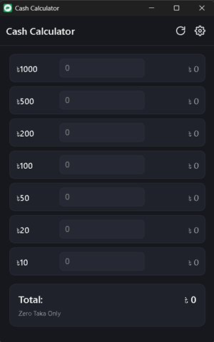
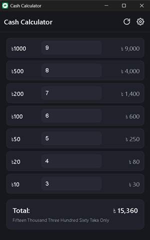
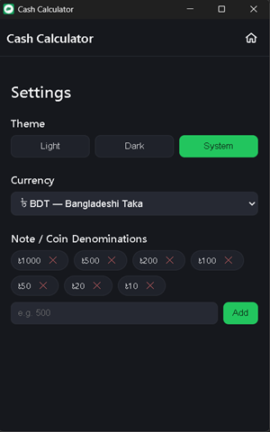

<div align="center">

# 💵 Cash Calculator

**A free, open-source, lightweight cash-counting app with multi-currency support.**

Count your notes and coins, get an instant total, and see the amount
written out in words — using the lakh/crore system for BDT and INR, or
the standard thousand/million system for USD, EUR, and GBP — all in a
native app under 10MB.

[](./LICENSE)
[](#installation)
[](https://tauri.app)
[](#contributing)

</div>

---

## Table of Contents

- [Features](#features)
- [Screenshots](#screenshots)
- [Installation](#installation)
- [Usage](#usage)
- [Building from Source](#building-from-source)
- [Project Structure](#project-structure)
- [Customization](#customization)
- [Versioning](#versioning)
- [Contributing](#contributing)
- [License](#license)

---

## Features

- ⚡ **Instant totals** — enter counts per denomination, the sum updates as you type, no delay.
- 💱 **Multi-currency** — switch between BDT, INR, USD, EUR, and GBP from Settings. Amount formatting and the numbering system follow the selected currency automatically.
- 🔤 **Amount in words** — for BDT/INR, converted using the South Asian numbering system (lakh, crore), e.g. *"Twelve Lakh Thirty Four Thousand Five Hundred Sixty Seven Taka Only"*. For USD/EUR/GBP, the standard international system (thousand, million, billion) is used instead.
- 🧾 **Custom denominations** — add or remove any note/coin value from Settings, not locked to a fixed list.
- 🎨 **Light / Dark / System theme**.
- 🔄 **One-tap reset**.
- 🔒 **100% local** — no internet connection, accounts, ads, or telemetry. Your data never leaves your device.
- 🪶 **Lightweight** — built with Tauri (Rust + native WebView2), so the installer is a few MB instead of the 100MB+ typical of Electron apps.
- 🪟 **Remembers window position & size** — reopens exactly where you left it.

---

## Screenshots





---

## Installation

Download the [latest](https://github.com/mrdeveloperjis/cash-calculator/releases/latest) installer and run it. No admin rights required.

- **Supported:** Windows 10 and above (64-bit)
- **Total size:** less than 10 MB

---

## Usage

1. Open the app.
2. Enter how many of each note/coin you're counting in its row.
3. The total amount and its word form update live.
4. Tap **⟳** (top bar) to reset all counts.
5. Tap **⚙** to open Settings — change theme, switch currency (BDT/INR/USD/EUR/GBP), or edit denominations. Tap **⌂** to return to the calculator.

---

## Building from Source

**Requirements:** [Node.js](https://nodejs.org) and [Rust](https://rustup.rs) (via `rustup`, no admin rights needed).

```bash
git clone https://github.com/mrdeveloperjis/cash-calculator.git
cd cash-calculator

# install dependencies
npm install

# run in development mode with hot reload
npm run tauri dev

# build the production installer
npm run tauri build
```

Output installers will be in:
```
src-tauri/target/release/bundle/nsis/   # .exe
src-tauri/target/release/bundle/msi/    # .msi
```

New to Rust/Node setup? See [`SETUP_GUIDE.md`](./SETUP_GUIDE.md) for a full beginner walkthrough.

---

## Project Structure

```
cash-calculator/
├── src/                      # Frontend — plain HTML/CSS/JS, the whole UI
│   ├── index.html
│   ├── style.css
│   └── app.js
├── src-tauri/                # Rust shell — minimal, just launches the window
│   ├── src/main.rs           # Entry point — creates the window, registers plugins
│   ├── capabilities/         # Permission grants for Tauri plugins (e.g. window-state)
│   ├── icons/                # App icons for the installer and window
│   ├── Cargo.toml            # Rust dependencies and build profile
│   └── tauri.conf.json       # Window size, title, bundle targets
└── package.json              # npm scripts and Tauri CLI dependency
```

No frontend framework is used on purpose — it keeps the codebase small and easy for anyone to read, fork, and modify.

---

## Customization

| What | Where |
|---|---|
| Default note/coin values | `DEFAULT_DENOMS` in `src/app.js` |
| Window size limits | `app.windows[0]` in `src-tauri/tauri.conf.json` |
| App name | `productName` in `tauri.conf.json`, `name` in `package.json` |
| Colors / theme | CSS variables at the top of `src/style.css` |
| App icon | replace files in `src-tauri/icons/`, then rebuild |

---

## Versioning

Keep these three in sync when bumping the version:

- `src-tauri/tauri.conf.json` → `"version"`
- `src-tauri/Cargo.toml` → `version =` under `[package]`
- `package.json` → `"version"`

---

## Contributing

Issues and pull requests are welcome!

1. Fork the repo
2. Create a branch (`git checkout -b feature/your-feature`)
3. Commit your changes
4. Open a pull request

Please keep changes framework-free and lightweight in the spirit of the project.

---

## License

Licensed under the [MIT License](./LICENSE) — free to use, modify, and distribute.